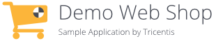
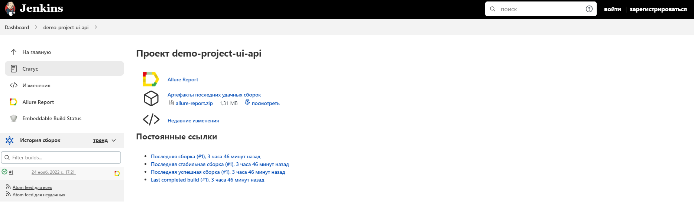
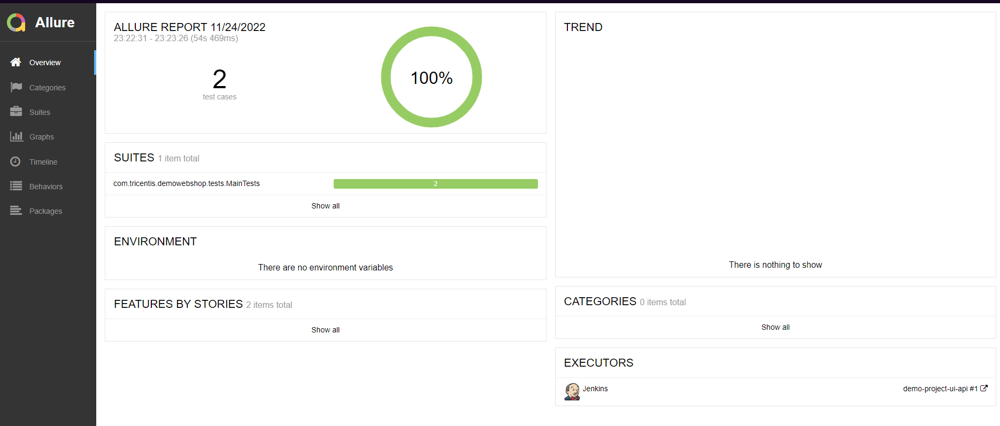
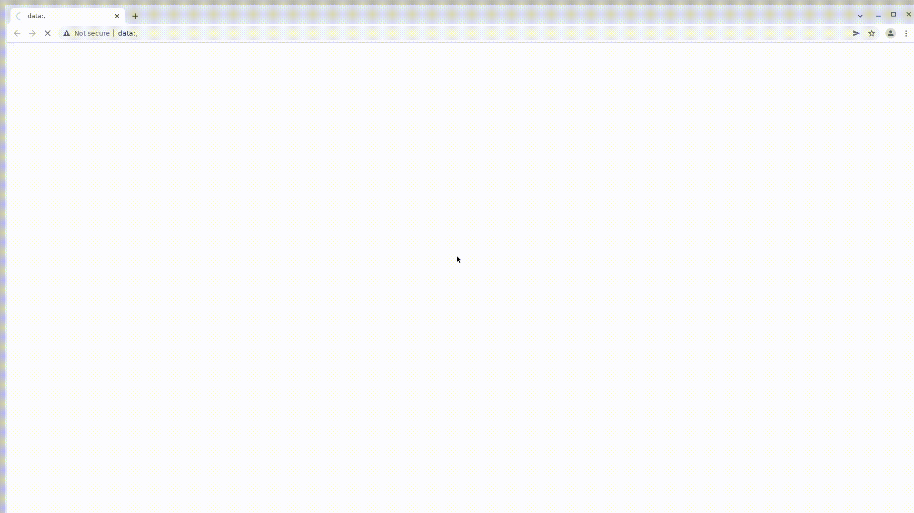
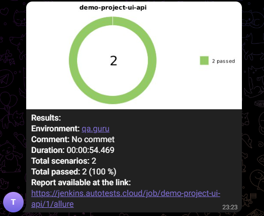

# Демонстрационный проект: UI + API тесты <a target="_blank" href="https://demowebshop.tricentis.com/">demowebshop.tricentis.com</a>.
<p align="center">

</p>

## :mag_right: Содержание:

- [Тестовая модель](#receipt-Тестовая-модель)
- [Стек](#wrench-Стек)
- [Jenkins сборка](#window-Jenkins-сборка)
- [Локальный запуск](#arrow_forward-Локальный-запуск)
- [Удаленный запуск](#arrow_forward-Удаленный-запуск)
- [Allure отчет](#signal_strength-Allure-отчет)
- [Видео прохождения теста Selenoid](#signal_strength-Видео-прохождения-теста-Selenoid)
- [Отчёт в telegram](#signal_strength-Отчёт-в-telegram)

## :receipt: Тестовая модель

- Регистрация пользователя
- Редактирование профиля


## :wrench: Стек
<p align="center">


</p>

## 	:window: Jenkins сборка
</a>  <a target="_blank" href="https://jenkins.autotests.cloud/job/demo-project-ui-api/">Jenkins job</a>
<p align="center">
<a href=""></a>
</p>


### :arrow_forward: Локальный запуск:
```
gradle clean localTest
```
### :arrow_forward: Удаленный запуск:
```
gradle clean remoteTest
```
или
```
gradle clean
test
-Dbrowser=${BROWSER}
-DbrowserVersion=${BROWSER_VERSION}
-DbrowserSize=${BROWSER_SIZE}
-DbrowserMobileView="${BROWSER_MOBILE}"
-DremoteDriverUrl="${REMOTE_DRIVER_URL}"
-DvideoStorage="https://selenoid.autotests.cloud/video/"
```
## :signal_strength: Allure-отчет
</a> Отчет в <a target="_blank" href="https://jenkins.autotests.cloud/job/demo-project-ui-api/allure/">Allure report</a>
<p align="center">
<a href=""></a>
</p>

## :signal_strength: Видео прохождения теста Selenoid
<p align="center">
<a href=""></a>
</p>

## :signal_strength: Отчёт в telegram

<a href=""></a>

